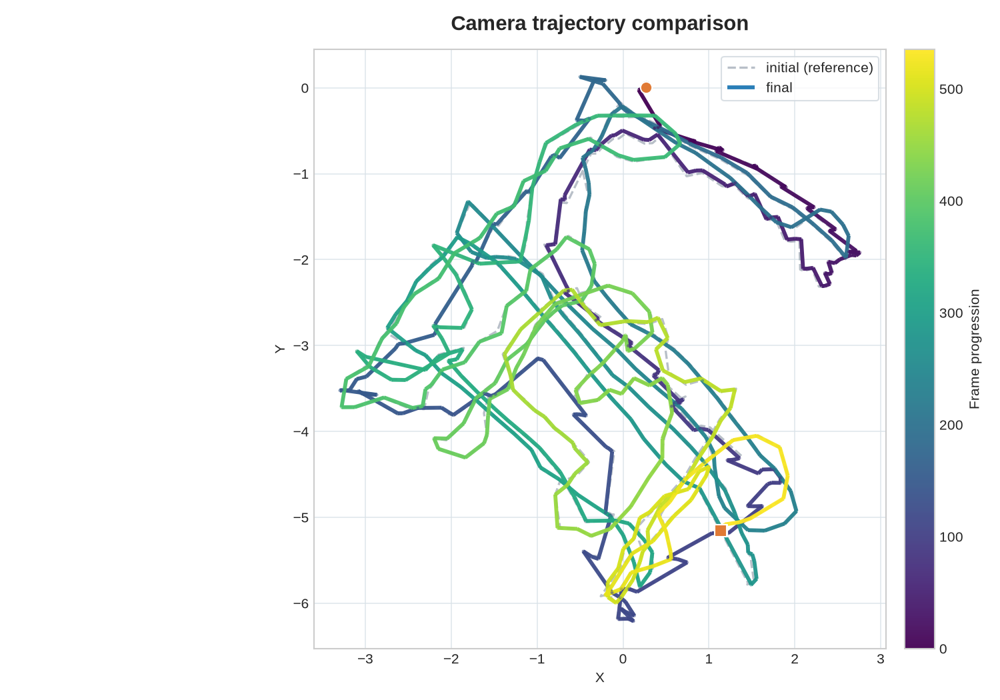
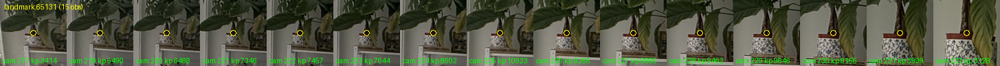

# Scripts

This folder contains shared inspection and visualization utilities. KITTI-only
preparation, evaluation, reporting, and LiDAR-merging tools are grouped under
[`kitti/`](kitti/); see the [KITTI workflow guide](kitti/README.md).

## Top-level Python scripts

Run the commands below from the repository root. Use explicit paths because the
scripts' historical defaults are relative to the current working directory.

### Plot camera trajectories

```bash
python3 scripts/plot_trajectory.py \
	--files data/trajectory/initial.txt data/trajectory/final.txt \
	--top-view --fancy --out output/trajectory_comparison.png
```

Input files use TUM rows: `timestamp x y z qx qy qz qw`. The output is a PNG
line plot with a subdued reference path and a time-colored optimized path.
Start points are circles and end points are squares. Add `--heading` only when
camera-forward arrows are useful for a diagnostic plot. With exactly two
trajectories, the terminal also prints their positional RMSE. Omit `--out` to
open an interactive Matplotlib window.



*Example: the dashed gray path is the initial estimate; the viridis ramp shows
frame progression for the final estimate. Circles mark starts and squares mark
ends.*

### Inspect landmark observation patches

```bash
python3 scripts/visualize_landmarks.py \
	--csv data/landmark_observations.csv \
	--img-dir data/undistorted \
	--min-observations 2 --num-samples 8 \
	--out-dir output/landmark_checks
```

This creates one `landmark_<id>.png` per selected track. Each PNG is a horizontal
strip of image crops centered on the measured feature, with a red circle marking
the observation. A good track shows the same physical corner or texture patch in
every crop; unrelated patches indicate an incorrect feature association.

### View or export sparse landmarks

```bash
python3 scripts/view_landmark_pointcloud.py \
	--csv data/landmark_observations.csv \
	--color-by observations \
	--export-ply output/landmarks.ply --no-show
```

The PLY contains one XYZ point per unique landmark. With observation coloring,
purple/blue points have less track support and green/yellow points have more.
Remove `--no-show` to inspect the same cloud in an interactive 3D Matplotlib
window. CloudCompare or MeshLab is preferable for large PLY files.

### Inspect the binary landmark cache

Print the track-length histogram and image coverage retained at different
minimum observation counts:

```bash
python3 scripts/landmark_cache_stats.py \
	--cache data/landmarks_cache.bin \
	--timestamps data/timestamps.txt \
	--coverage-thresholds 2,3,4
```

This writes no files. The terminal table reports how many landmarks have each
track length and how many camera images remain covered after each threshold.

Render cache tracks as image strips:

```bash
python3 scripts/visualize_landmark_cache.py \
	--cache data/landmarks_cache.bin \
	--img-dir data/undistorted \
	--timestamps data/timestamps.txt \
	--min-observations 4 --max-landmarks 200 \
	--out-dir output/landmark_cache_track_images
```

Each `tracker_<id>.png` is a horizontal sequence of square crops. A yellow ring
marks the feature and green text identifies the camera and keypoint. As with the
CSV visualizer, consistent scene content across the strip indicates a plausible
multi-view track.



*Example: the yellow feature ring remains on the same textured scene detail across
fifteen cameras; the green labels identify each camera and cached keypoint.*

All tools support `--help`. The plotting scripts require Matplotlib; crop-strip
generation requires Pillow. These are inspection utilities and do not modify a
reconstruction.
