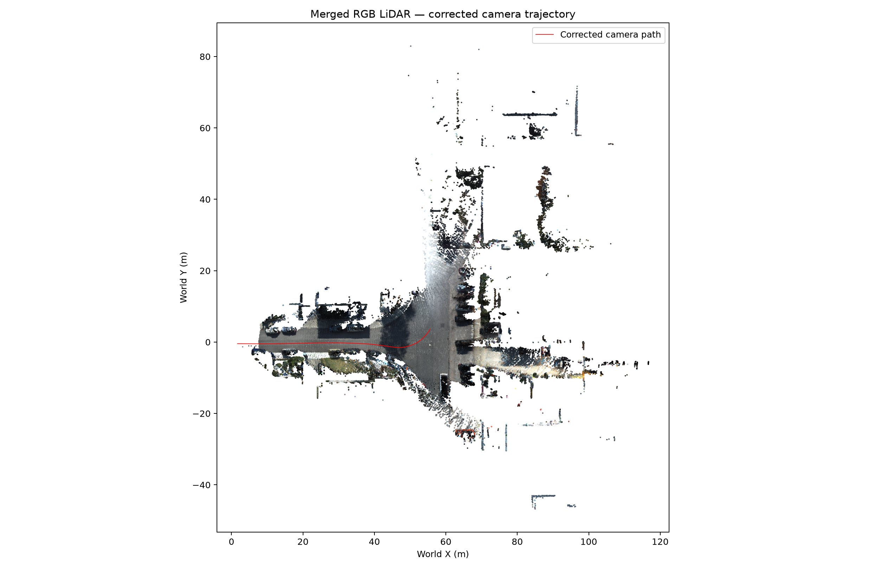

# KITTI Scripts

These scripts adapt KITTI raw drives and LiDAR SLAM results for this repository,
evaluate optimized trajectories against KITTI OXTS, and generate LiDAR-based 3DGS
initialization data. Run commands from the repository root.

## Script status

| Script | Status | Purpose |
|---|---|---|
| `prepare_kitti_pipeline.py` | Reusable | Prepare timestamps, optimized LIO poses, rectified intrinsics, camera-LiDAR extrinsic, associations, and a C++ pipeline config. |
| `evaluate_kitti_poses.py` | Reusable | Compare TUM camera trajectories with KITTI OXTS using rigid alignment without scale. |
| `merge_camera_corrected_lidar_rgb.py` | Reusable | Transform local LiDAR scans with optimized camera poses and color them from rectified images. |
| `compare_lidar_poses.py` | Reusable diagnostic | Convert optimized camera poses back to LiDAR poses and compare them with raw and optimized LIO references. |
| `report_kitti_run.py` | C++-pipeline diagnostic | Produce per-frame landmark coverage and BA reports from the richer root C++ output format. |

The first four scripts are generally useful. `report_kitti_run.py` remains
useful for the root C++ pipeline but expects artifacts that the Python workflow
does not export.

## Prepare a KITTI drive

Configure `kitti_prepare.json` with the KITTI sequence, LiDAR SLAM directory,
camera, image range, and `pose_field`. Use `optimized_pose` for the optimized LIO
trajectory. Keep `camera_time_offset_seconds` at `0.0` when both streams already
share the same time basis.

```bash
python3 scripts/kitti/prepare_kitti_pipeline.py \
  --config kitti_prepare.json \
  --prepare-only
```

The prepared directory is range-specific, for example:

```text
output/kitti_prepared/image_03_0000000070_0000000500/
```

It contains `timestamps.txt`, `key_frames.jsonl`, `intrinsics.txt`,
`camera_lidar_extrinsic.json`, `image_lidar_association.csv`,
`preparation_summary.json`, and `pipeline.yaml`.

## Test the preparer

`tests/test_prepare_kitti.py` is the unit test for
`prepare_kitti_pipeline.py`. It verifies rectified camera/LiDAR calibration,
inclusive image-range selection, promotion of `optimized_pose` to `lio_pose`,
duplicate pose revision handling, pose timestamp coverage policies, image
dimensions, associations, and generated YAML metadata.

The tests create synthetic KITTI images, calibration files, and LIO records in
temporary directories. They do not read, modify, or delete the real KITTI data
or generated reconstruction outputs.

Run all preparation tests from the repository root:

```bash
python3 -m unittest -v tests.test_prepare_kitti
```

Run one test by its full name when debugging a specific behavior:

```bash
python3 -m unittest \
  tests.test_prepare_kitti.KittiPrepareTest.test_pose_range_clips_or_errors_explicitly
```

A successful run reports four passing tests followed by `OK`. These tests only
validate input preparation; they do not run feature matching, bundle adjustment,
OXTS evaluation, or 3DGS training.

## Run the two-round Python workflow

Adapt the prepared directory to the legacy Python input layout:

```bash
P=output/kitti_0035_prepared/image_03_0000000000_0000000119
D=data_kitti_0035_0_119
SEQ=/path/to/2011_09_26_drive_0035_sync

rm -rf "$D"
mkdir -p "$D"
grep -v '^#' "$P/timestamps.txt" > "$D/timestamps.txt"
cp "$P/key_frames.jsonl" "$P/intrinsics.txt" "$D/"
cp "$P/camera_lidar_extrinsic.json" "$D/tuned_camera_lidar_extrinsic.json"
ln -s "$SEQ/image_03/data" "$D/undistorted"
```

Run both rounds:

```bash
./scripts/python_version/run_multiround_pipeline.sh \
  --data data_kitti_0035_0_119 \
  --first-output output/kitti_0035_python_0_119_multiround_first \
  --output output/kitti_0035_python_0_119_multiround_final \
  --max-images -1 \
  --translation-prior-weight 100 \
  --rotation-prior-weight 10 \
  --force
```

This performs pose initialization, triangulation, first-round BA, validation,
track extension, second-round BA, and final validation. No time offset option is
used; camera poses are initialized by direct interpolation at image timestamps.

## Evaluate against OXTS

```bash
python3 scripts/kitti/evaluate_kitti_poses.py \
  --sequence /path/to/2011_09_26_drive_0035_sync \
  --camera image_03 \
  --start-id 0 \
  --poses \
    prior=output/kitti_0035_python_0_119_multiround_first/poses_lio_prior_tum.txt \
    round1=output/kitti_0035_python_0_119_multiround_first/poses_optimized_tum.txt \
    round2=output/kitti_0035_python_0_119_multiround_final/poses_optimized_tum.txt \
  --json output/kitti_0035_multiround_oxts.json
```

The report includes rigidly aligned ATE, orientation error, one-frame relative
pose error, and position second-difference jitter. OXTS is an independent KITTI
reference, but it is not survey-grade camera ground truth.

### Drive 0035 OXTS comparison

The following comparison is from
`output/kitti_0035_multiround_oxts_comparison.json`. Each trajectory is rigidly
aligned to the OXTS-derived camera trajectory before absolute trajectory error
(ATE) and orientation error are computed. The `prior` row is the LIO-prior
trajectory; `round2` is the final optimized camera trajectory.

| Metric | LIO prior | Optimized pose (round 2) |
|---|---:|---:|
| ATE median (m) | 0.0492 | 0.0403 |
| ATE P90 (m) | 0.0942 | 0.0789 |
| ATE max (m) | 0.1677 | 0.1878 |
| Orientation error median (deg) | 1.3061 | 0.6043 |
| Orientation error P90 (deg) | 1.5857 | 0.9126 |
| One-frame translation error median (m) | 0.0230 | 0.0206 |
| One-frame translation error P90 (m) | 0.0419 | 0.0404 |
| One-frame rotation error median (deg) | 0.0971 | 0.0147 |
| One-frame rotation error P90 (deg) | 0.1591 | 0.0778 |
| Position jitter median (m) | 0.0166 | 0.0079 |
| Position jitter P90 (m) | 0.0451 | 0.0211 |

Relative to the LIO prior, the final optimized pose reduces median ATE by
`0.0090 m`, median orientation error by `0.7018 deg`, median one-frame
translation error by `0.0024 m`, and median one-frame rotation error by
`0.0825 deg`. These are errors against the OXTS reference after rigid
alignment; they are different from the LIO-to-optimized correction magnitudes
reported below.

## Multiround-final results

The current two-round Python/Ceres result for Drive 0035, camera `image_03`,
image IDs 0--119 contains 120 images, 19,647 active landmarks, and 168,326
retained observations. It uses direct timestamp synchronization
(`t_lidar = t_image`), translation prior weight `100`, and rotation prior weight
`10`.

The final workflow metrics are stored in
`output/kitti_0035_python_0_119_multiround_final/evaluation.json` and
`multiround_summary.json`:

| Metric | First round | Second round / final |
|---|---:|---:|
| Landmarks | 19,678 | 19,647 |
| Observations | 152,278 | 168,326 |
| Reprojection median (px) | 0.3938 | 0.2834 |
| Reprojection P90 (px) | 1.0913 | 0.8282 |
| Reprojection P95 (px) | -- | 1.0943 |
| Reprojection max (px) | -- | 2.0000 |
| Validation | pass | pass |

Track extension proposed 18,998 observations, retained 16,907, and rejected
2,091. The final held-out epipolar error was `0.0993 px` median and `0.4005 px`
P90 over 54,830 matches.

### LIO-prior to optimized displacement

The following values are computed directly from the final run's pose files:

| Quantity | Samples | RMSE | Median | P90 | P95 | Max |
|---|---:|---:|---:|---:|---:|---:|
| Translation displacement | 120 | 0.0328 m | 0.0262 m | 0.0460 m | 0.0568 m | 0.0823 m |
| Rotation displacement | 120 | 0.4875 deg | 0.4476 deg | 0.6620 deg | 0.7428 deg | 0.8363 deg |

These are correction magnitudes, not absolute errors against ground truth.

### Merged LiDAR-RGB overview

The latest merged LiDAR-RGB output is:

```text
output/kitti_0035_lidar_rgb_multiround_final/
```

It contains 119 LiDAR scans, 981,777 RGB-colored points, and 3,414,958 full
points. The red line shows the corrected camera path through the colored LiDAR
map.



The merged overview uses the camera-pose source recorded in its
`summary.json`. The BA metrics above come from the newer multiround-final pose
output, so the two output directories should not be treated as the same exact
pose export.

## Merge LiDAR with final poses

`merge_camera_corrected_lidar_rgb.py` expects a dataset package containing
`images/` and `provenance/`. The provenance directory must contain:

```text
preparation_summary.json
intrinsics.txt
camera_lidar_extrinsic.json
key_frames.jsonl
timestamps.txt
poses_optimized_tum.txt
```

Then run:

```bash
python3 scripts/kitti/merge_camera_corrected_lidar_rgb.py \
  --dataset output/kitti_0035_multiround_final_dataset \
  --output output/kitti_0035_lidar_rgb_multiround_final \
  --voxel-size 0.05 \
  --maximum-image-dt 0.30 \
  --maximum-images-per-scan 5
```

The main products are `merged_lidar_full.ply`, `merged_lidar_rgb.ply`,
`scan_manifest.csv`, projection previews, and `summary.json`.

## Create points3D.txt initialization

The generic LiDAR initializer remains under `tools/` because it is not specific
to KITTI:

```bash
python3 tools/lidar_init_3dgs_dataset.py \
  --reconstruction output/kitti_0035_python_0_119_multiround_final \
  --lidar-ply output/kitti_0035_lidar_rgb_multiround_final/merged_lidar_rgb.ply \
  --images data_kitti_0035_0_119/undistorted \
  --output output/kitti_0035_multiround_final_3dgs_lidar_init \
  --max-camera-distance 60.0 \
  --max-knn-distance 0.5
```

This keeps the final optimized `cameras.txt` and pose-only `images.txt`, replaces
visual SfM points with filtered RGB LiDAR points in `points3D.txt`, and links the
training images.

## Generated files versus scripts

Directories under `output/`, feature caches, logs, plots, reports, and prepared
range directories are generated artifacts. They can be regenerated when the
source images, LIO results, calibration, and configuration are available.

The scripts in this folder are reusable source utilities and should be kept.
